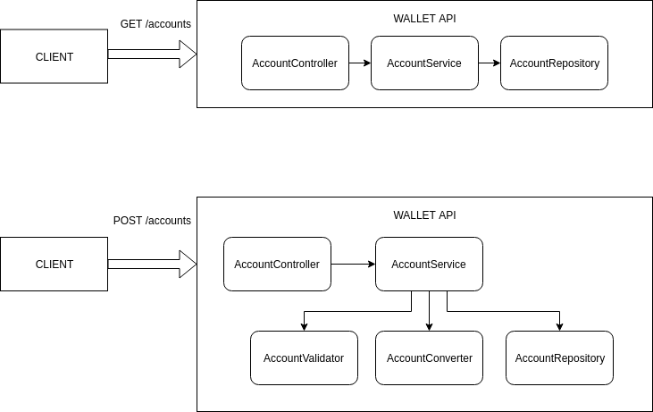

# Engineering Design

## Architecture




- Will be written in Java.
- Will be written using Spring Framework (Spring web and Spring Boot).

## HTTP endpoints

### List accounts

Inside the method in controller GET request for list accounts:

1. Call `AccountService#listAccounts()`
1. `AccountService#listAccounts()` returns a list of accounts entries from the database.
   1. If there is not any entry, then return a empty list.
   1. Always return first 20 entries.
   1. Service must handle database exceptions.

##### POJOS

```java
class ListAccountsResponse {
    List data = new ArrayList<AccountEntry>;
}

class AccountEntry {
    String account;
    String fullname;
}
```


##### Controller

```java
@RestController
class AccountController {
    @GetMapping("/accounts")
    public ListAccountsResponse listAccounts(){
        return accountService.listAccounts();
    }
}
```


##### Service

```java
@Service
class AccountService {
    ListAccountsResponse listAccounts() {
        List<Account> accounts = repository.findAccounts();
        return convert(accounts);
    }
}
```

##### Repository

```java
@Repository
class AccountRepository {
    List<Account> findAccounts() {
        // SELECT * FROM accounts LIMIT 20 ORDER BY id DESC;
    }
}
```


### New account

- Validate the input
- Convert the request POJO into an entity to the database
- Store information to the database
- Be sure the `id` of the created entity is included back to the user


Inside the method in controller POST request for a new account:

1. Call `AccountService.createAccount(account)`

2. `AccountService.createAccount(Account account)` calls to `AccountService.validate(account)` input method

3. `AccountService.validate(Account account)` evaluates the received fields in objects fill in the required criteria (maximum and minimum number of characters, not special characters, not blank fileds, etc). If this evaluation passes, this returns true, else returns false.

4. Once `AccountService.validate(Account account)` has returned , `AccountService.createAccount(Account account)` evaluates the returned value which is `boolean` and so if it's true this open a connection to database calling `AccountModel.save(account)`, while if it is false, so returns a JSON with a corresponding error message, for example:

   ```json
   {
       "errors": [
           {
               "property": "account",
               "message": "Maximum 20 charactes allowed"
           },
           {
               "property": "fullname",
               "message": "Maximum 255 charactes allowed"
           },
       ]
   }
   ```

   

3. `AccountModel.save(Account account)` open a MySQL connection to the `wallet` database (by calling a corresponding method  that open the connection if already isn't) and send the corresponding query `INSERT INTO ...` to the opened database. If query has been successful, it returns `true`.

4. As `AccountModel.save(account)` has return to `AccountService.createAccount(Account account)`, if value is true, so returns a JSON for successfully creation, for example for the first supposed created user:

   ```json
   {
       "id": 1,
       "account": "username",
       "fullname": "Full Name",
   }
   ```

   If false, this returns a JSON with exception message. For example:

   ```json
   {
       "error": "Error Establishing Database Connection"
   }
   ```


##### POJOS

```java
class Account{
    Long id;
    String account;
    String fullname;
    String password;
}

class CreateAccountResponse {
    Long id;
    String account;
    String fullname;    
}

class CreateAccountRequest {
    String account;
    String fullname;
    String password;    
}
```


##### Controller

```java
@RestController("/accounts")
class AccountController {
    @PostMapping
    @ResponseStatus(201)
    public CreateAccountResponse createAccount(@RequestBody CreateAccountRequest req){
        return accountService.createAccount(req);
    }
}
```


##### Service

```java
// 1. Validate inputs accountValidator.validate(request)
// 2. If isn't valid return the error message 
// 3. If valid, convert request into Account object fields
// 4. Insert this Account by calling accountRepository.insertAccount(account)
// 5. Convert Account we get back from accountRepository.insertAccount(account) to CreateAccountResponse and return

@Service
class AccountService {
    CreateAccountResponse createAccount(req) {
        ValidationResult result = new accountValidator.validate(req)
            
        if (!result.isValid()){
        	return invalidRequest(result);            
        } 
        
        Account account = accountConverter.convert(req);        
        account = accountRepository.insertAccount(account);        
       	return accountConverter.convert(account);
    }
}
```


##### Validator

```java
@Component
class AccountValidator {
    
    ValidationResult validate(Account account) {     
        
        ValidationResult result = new ValidationResult();
        
        if (account.getAccount() == ""){
            result.addError("account", "Field cannot be empty");
        } 
        
        if (account.getFullName() == "" ) {
            result.addError("fullname", "Field cannot be empty");
        } 
        
        if (account.getPassword() == "") {
            result.addError("password", "Field cannot be empty");
        }         
        
        return result;
    }    
    
} 

class ValidationResult extends HashMap<String,String> {        
    boolean isValid(){
        return isEmpty();
    }
}

```


##### Converter

```java
@Component
class AccountConverter {  
    Account convert(CreateAccountRequest req){
        // Convert to DB object (Entity)
    }
    
    CreateAccountResponse convert(Account){        
        // Convert DB object to response object
    } 
} 
```


##### Repository

```java
@Repository
class AccountRepository {
    Account insertAccount(Account account){
        // INSERT INTO accounts(:account_name,:fullname);
    }
}
```


## Database

For data storage we're going to use MySQL

### Schema

#### Table: Account

| Column       | Type         | Key     | Nullable |
| ------------ | ------------ | ------- | -------- |
| id           | int(11)      | primary | No       |
| account_name | varchar(20)  |         | No       |
| fullname     | varchar(255) |         | No       |

**Indexes:** id