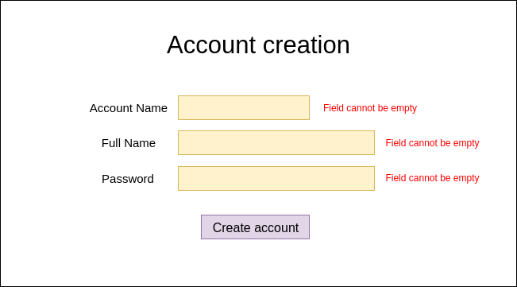

# LIST AND CREATE ACCOUNTS

## List accounts

Shows all accounts in system, has a button that allows to go to the account creation view.
The name of each acount can be clicked and this will lead to a blank page (for the moment)

## Create account

Shows a form to enter the account information:

- Account name: Must be unique among all other names on the system.
- Person fullname: should be minimum 1 character long or maximun 255 characters.

Finally when we press submit button, if the content provided in the form is valid, this will redirect to list accounts page, else will show an feedback error message showing form mistakes.

## Wireframes

#### List accounts page


#### Forms page 

Create Account:


#### Forms page error

Create Account error blank:



Create Account error forbidden characters:


Create Account error maximum characters allowed:


Create Account error minimum characters:


## API contract

### List accounts page

| RES API spec  | content       |
| ------------- |:-------------:|
| Request headers     | --- |
| Request HTTP method | GET      |
| Request URL       | /accounts      |
| Response headers       | Content-Type: application/json     |
| Response status code       | 200     |

#### Response body

```json
{
    "data": [
        {
            "account": "username1",
            "fullname": "User Name 1"
        },
        {
            "account": "username2",
            "fullname": "User Name 2"
        }
    ]
}
```

### Forms page

#### Sending form

| RES API spec  | content       |
| ------------- |:-------------:|
| Request headers     | Content-Type: application/json  |
| Request HTTP method | POST      |
| Request URL       | /accounts      |
| Response headers    | Content-Type: application/json  |
| Response status code       | 201 or 400  |

#### Request body

```json
{
    "account": "username1",
    "fullname": "User Name 1",
    "password": "password1"
}
```

#### Response body success

```json
{
    "id": 1,
    "account": "username1",
    "fullname": "User Name 1",
    "password": "password1"
}
```

#### Response body error

```json
{
    "errors": [
        {
            "property": "account",
            "message": "Maximum 20 charactes allowed"
        },
        {
            "property": "fullname",
            "message": "Maximum 255 charactes allowed"
        },
    ]
}
```